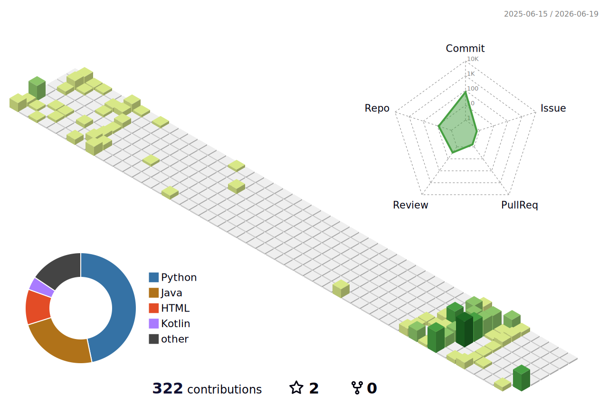



### Hey, I'm Basit

Backend developer, mostly Python. I build APIs, automation, and small tools — especially when something I use daily has a gap worth fixing.

## What I build

**Automation & integrations**  
Scripts and pipelines that connect services — deployment setup, dynamic IP updates, pulling data from one API and pushing it somewhere useful.

**Personal productivity tools**  
Trackers and small web apps for the boring problems that deserve a proper backend — diet logging, job applications, ticket booking, that kind of thing.

**Media & consumption tooling**  
When official apps fall short — better shuffle logic, syncing watchlists to Notion, tracking things I actually care about. Anime lists, films, music; if there's an API and the UX annoys me, I'll probably build something.

## Stack

Python · Django · FastAPI · Flask · Docker · REST APIs · Google Sheets API · Notion API · Kotlin · Shell · Vercel · ArgoCD

## Currently

- Building my portfolio site
- Tinkering with LLM-related stuff
- Branching into Kotlin for a personal Spotify tool on the side
- Always up for interesting backend or automation problems
- **Todo:** anime "currently watching" widget via Jikan/MAL API

## Get in touch

- **Email:** [basitzaheer02@gmail.com](mailto:basitzaheer02@gmail.com)
- **LinkedIn:** [muhammad-basit-zaheer](https://www.linkedin.com/in/muhammad-basit-zaheer/)

---

## Off the clock

Usually in an RPG, catching up on anime, or arguing that Spotify shuffle isn't actually random — which is how side projects get started.

<picture>
  <source media="(prefers-color-scheme: dark)" srcset="https://github.com/basit3000/basit3000/raw/output/github-contribution-grid-snake-dark.svg">
  <source media="(prefers-color-scheme: light)" srcset="https://github.com/basit3000/basit3000/raw/output/github-contribution-grid-snake.svg">
  
</picture>

