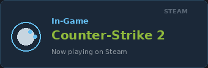
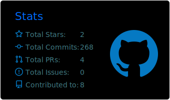



### Hey, I'm Basit

Backend developer, mostly Python. I build APIs, automation, and small tools — especially when something I use daily has a gap worth fixing.

 

 

---

## What I build

**Automation & integrations**  
Scripts and pipelines that connect services — deployment setup, dynamic IP updates, pulling data from one API and pushing it somewhere useful.

**Personal productivity tools**  
Trackers and small web apps for the boring problems that deserve a proper backend: diet logging, job applications, ticket booking, that kind of thing.

**Media & consumption tooling**  
Better shuffle logic, syncing watchlists to Notion, tracking things I actually care about. Anime lists, films, music — if there's an API and the UX annoys me, I'll probably build something.

---

## Side quests

Personal repos — the kind you start because the official app or workflow wasn't good enough.

<table>
  <tr>
    <td align="center" valign="top">
      
    </td>
    <td align="center" valign="top">
      
    </td>
  </tr>
  <tr>
    <td align="center" valign="top">
      
    </td>
    <td align="center" valign="top">
      
    </td>
  </tr>
</table>

*anime → Notion · shuffle that lies less · one-command Django · diet data in Sheets*

---

## Stack

`Python` · `Django` · `FastAPI` · `Flask` · `Docker` · `REST APIs` · `Google Sheets API` · `Notion API` · `Kotlin` · `Shell` · `Vercel` · `ArgoCD`

---

## Currently

- Building my portfolio site
- Tinkering with LLM-related stuff
- Branching into Kotlin for a personal Spotify tool on the side
- Always up for interesting backend or automation problems
- **Todo:** anime "currently watching" widget via Jikan/MAL API

---

## Off the clock

Usually in an RPG, catching up on anime, or arguing that Spotify shuffle isn't actually random — which is how side projects get started.

### Now playing

<table>
  <tr>
    <td align="center" width="340">
      
    </td>
    <td width="16"></td>
    <td align="center" width="340">
      
    </td>
  </tr>
</table>

---

## Activity

 

 

 

<picture>
  <source media="(prefers-color-scheme: dark)" srcset="https://raw.githubusercontent.com/basit3000/basit3000/output/github-contribution-grid-snake-dark.svg">
  <source media="(prefers-color-scheme: light)" srcset="https://raw.githubusercontent.com/basit3000/basit3000/output/github-contribution-grid-snake.svg">
  
</picture>

---

## Get in touch

- **Email:** [basitzaheer02@gmail.com](mailto:basitzaheer02@gmail.com)
- **LinkedIn:** [muhammad-basit-zaheer](https://www.linkedin.com/in/muhammad-basit-zaheer/)
