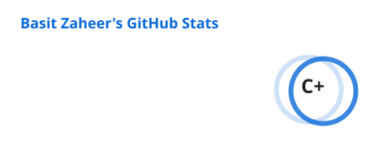
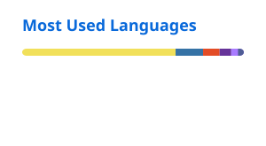
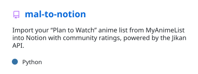
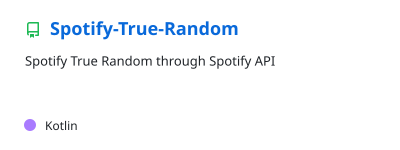
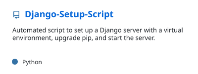
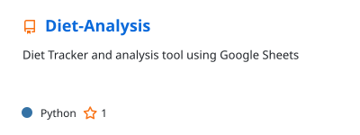
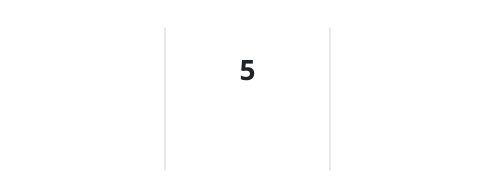

# Hey, I'm Basit

Backend developer, mostly Python. I build APIs, automation, and small tools — especially when something I use daily has a gap worth fixing.

My [portfolio](https://basitzaheer.de) brings it all together: projects, live integrations, and a little Dota-inspired personality.

  
  
  

Open to backend, automation &amp; integration projects

[Projects](#side-quests) · [Recent updates](#recently-updated) · [Stack](#stack) · [Live dashboard](#off-the-clock) · [Contact](#get-in-touch)

 

<picture>
  <source media="(prefers-color-scheme: dark)" srcset="./assets/cards/dark/stats.svg">
  
</picture>
&nbsp;
<picture>
  <source media="(prefers-color-scheme: dark)" srcset="./assets/cards/dark/top-langs.svg">
  
</picture>

 

---

## What I build

**Automation & integrations**  
Scripts and pipelines that connect services — deployment setup, dynamic IP updates, pulling data from one API and pushing it somewhere useful.

**Personal productivity tools**  
Trackers and small web apps for the boring problems that deserve a proper backend: diet logging, job applications, ticket booking, that kind of thing.

**Media & consumption tooling**  
Better shuffle logic, syncing watchlists to Notion, tracking things I actually care about. Anime lists, films, music — if there's an API and the UX annoys me, I'll probably build something.

---

## Side quests

Personal repos — the kind you start because the official app or workflow wasn't good enough.

<table>
  <tr>
    <td width="50%" align="center" valign="top">
      <a href="https://github.com/basit3000/mal-to-notion">
        <picture>
          <source media="(prefers-color-scheme: dark)" srcset="./assets/cards/dark/pin-mal-to-notion.svg">
          
        </picture>
      </a>
      
Bring your anime watchlist and community ratings into Notion.

      <a href="https://github.com/basit3000/mal-to-notion#readme">Explore MAL → Notion →</a>
    </td>
    <td width="50%" align="center" valign="top">
      <a href="https://github.com/basit3000/Spotify-True-Random">
        <picture>
          <source media="(prefers-color-scheme: dark)" srcset="./assets/cards/dark/pin-spotify-true-random.svg">
          
        </picture>
      </a>
      
Playlist shuffle for CLI, web, and Android. Spotify Premium required.

      <a href="https://github.com/basit3000/Spotify-True-Random#readme">Explore Spotify True Random →</a>
    </td>
  </tr>
  <tr>
    <td width="50%" align="center" valign="top">
      <a href="https://github.com/basit3000/Django-Setup-Script">
        <picture>
          <source media="(prefers-color-scheme: dark)" srcset="./assets/cards/dark/pin-django-setup-script.svg">
          
        </picture>
      </a>
      
Automate your Django environment and server setup.

      <a href="https://github.com/basit3000/Django-Setup-Script#readme">Explore Django Setup Script →</a>
    </td>
    <td width="50%" align="center" valign="top">
      <a href="https://github.com/basit3000/Diet-Analysis">
        <picture>
          <source media="(prefers-color-scheme: dark)" srcset="./assets/cards/dark/pin-diet-analysis.svg">
          
        </picture>
      </a>
      
Log and analyse diet data with Google Sheets.

      <a href="https://github.com/basit3000/Diet-Analysis#readme">Explore Diet Analysis →</a>
    </td>
  </tr>
</table>

*anime → Notion · shuffle that lies less · one-command Django · diet data in Sheets*

Also shipping: [live portfolio](https://basitzaheer.de) · [job-scout](https://github.com/basit3000/job-scout) · [PD-League](https://pkdota.com)

---

## Stack

`Python` · `Django` · `FastAPI` · `Flask` · `React` · `Vite` · `Docker` · `REST APIs` · `Google Sheets API` · `Notion API` · `Kotlin` · `Shell` · `Vercel` · `ArgoCD`

---

## Recently updated

Latest pushes to my public projects; dates are in UTC.

<!-- RECENT-PROJECTS:START -->
- **[Diet\-Analysis](https://github.com/basit3000/Diet-Analysis)** · Python · Last pushed 2026-09-21
- **[job\-scout](https://github.com/basit3000/job-scout)** · JavaScript · Last pushed 2026-09-13
- **[Translation\-service](https://github.com/basit3000/Translation-service)** · HTML · Last pushed 2026-09-08
<!-- RECENT-PROJECTS:END -->

---

## Currently

- [basitzaheer.de](https://basitzaheer.de) is live — Radiant/Dire portfolio with live Spotify, Steam, OpenDota matches, and MAL currently watching
- [Spotify True Random](https://github.com/basit3000/Spotify-True-Random) has a Python CLI, local web app, and Android app
- Job Scout and PD-League ([pkdota.com](https://pkdota.com)) are the other active builds
- Always up for interesting backend or automation problems

---

## Off the clock

Usually in an RPG, catching up on anime, or arguing that Spotify shuffle isn't actually random — which is how side projects get started.

The same live HUD as the [Gaming page](https://basitzaheer.de/gaming) — match history, currently watching, LeetCode, and Twitch.

### Now playing

Cards refresh periodically and may show cached activity.

<table>
  <tr>
    <td align="center" width="50%" valign="top">
      
       <a href="https://basitzaheer.de">Music on my portfolio</a>
    </td>
        <td align="center" width="50%" valign="top">
      
       <a href="https://steamcommunity.com/profiles/76561198355636398">Steam profile</a>
    </td>
  </tr>
</table>

 

<table>
  <tr>
    <td align="center" width="50%" valign="top">
      
       <a href="https://www.dotabuff.com/players/395370670">Dota match history</a>
    </td>
        <td align="center" width="50%" valign="top">
      
       <a href="https://myanimelist.net/animelist/MeyraMax">Anime watchlist</a>
    </td>
  </tr>
  <tr>
    <td align="center" width="50%" valign="top">
      
       <a href="https://leetcode.com/u/basit3000/">LeetCode profile</a>
    </td>
        <td align="center" width="50%" valign="top">
      
       <a href="https://www.twitch.tv/meyramax">Twitch channel</a>
    </td>
  </tr>
</table>

---

## Activity

<picture>
  <source media="(prefers-color-scheme: dark)" srcset="./assets/cards/dark/streak.svg">
  
</picture>

<picture>
  <source media="(prefers-color-scheme: dark)" srcset="https://raw.githubusercontent.com/basit3000/basit3000/output/github-contribution-grid-snake-dark.svg">
  
</picture>

---

## Get in touch

Have a backend, automation, or integration problem in mind? Let's talk.

  
  
  

- **Site:** [basitzaheer.de](https://basitzaheer.de)
- **Email:** [basitzaheer02@gmail.com](mailto:basitzaheer02@gmail.com)
- **LinkedIn:** [muhammad-basit-zaheer](https://www.linkedin.com/in/muhammad-basit-zaheer/)

[Back to top](#hey-im-basit)
