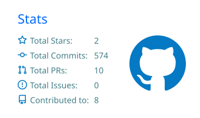

# Hey, I'm Basit

I like to code things like I build APIs, automation, and small tools especially when something I use daily has a gap worth fixing or a custom requirements I have is not available.

My [portfolio](https://basitzaheer.de) brings it all together: projects, live integrations, and a little Dota-inspired personality. :)

  
  
  

 

<picture>
  <source media="(prefers-color-scheme: dark)" srcset="./assets/cards/dark/stats.svg">
  
</picture>
&nbsp;
<picture>
  <source media="(prefers-color-scheme: dark)" srcset="./assets/cards/dark/top-langs.svg">
  
</picture>

 

---

## Some of the stuff I built

**Automation & integrations**  
Scripts and pipelines that connect services like deployment setup, dynamic IP updates, pulling data from one API and pushing it somewhere useful.

**Personal productivity tools**  
Trackers and small web apps for the boring problems that deserve a proper backend: diet logging, job applications, ticket booking, etc.

**Media & consumption tooling**  
Better shuffle logic, syncing watchlists to Notion, tracking things I actually care about. Anime lists, films, music.

---

## Stack

`Python` · `Django` · `FastAPI` · `Flask` · `React` · `Vite` · `Docker` · `REST APIs` · `Google Sheets API` · `Notion API` · `Kotlin` · `Shell` · `Vercel` · `ArgoCD`

### AI tools

`Claude Code`, `Cursor`, `Codex`, `Antigravity`, `goose`, `Hermes`, `Ollama`

---

## Currently

- [basitzaheer.de](https://basitzaheer.de) is live — Radiant/Dire portfolio with live Spotify, Steam, OpenDota matches, and MAL currently watching
- [Spotify True Random](https://github.com/basit3000/Spotify-True-Random) has a Python CLI, local web app, and Android app
- Job Scout and PD-League ([pkdota.com](https://pkdota.com)) are the other active builds
- Always up for interesting backend or automation problems

---

## Activity

<picture>
  <source media="(prefers-color-scheme: dark)" srcset="./assets/cards/dark/streak.svg">
  
</picture>

<picture>
  <source media="(prefers-color-scheme: dark)" srcset="https://raw.githubusercontent.com/basit3000/basit3000/output/github-contribution-grid-snake-dark.svg">
  
</picture>

---

## Get in touch

Have a backend, automation, or integration problem in mind? Let's talk.

  
  
  

[Back to top](#hey-im-basit)
